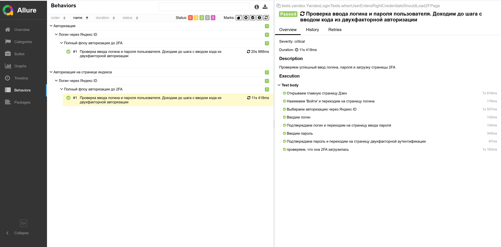

Тестовое задание для "ИНТЕР РАО". Автоматизация тест кейса,
когда пользователь успешно проходит авторизацию, используя связку логин/пароль

Запуск тестов и генерация отчета

1. Запустить тесты: mvn clean test
2. Сгенерировать отчет Allure: mvn allure:report
3. Открыть отчет в браузере: mvn allure:serve

Пример allure отчёта по тесту

